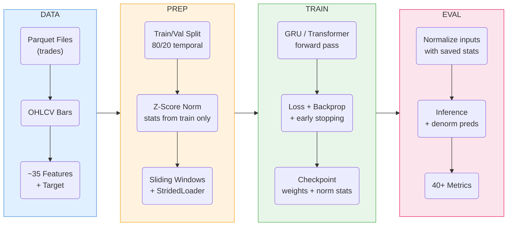
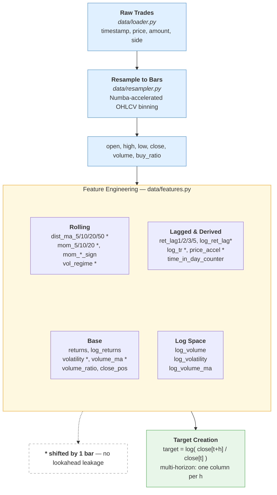
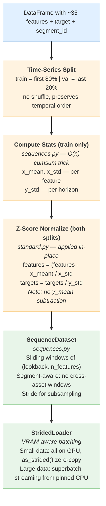
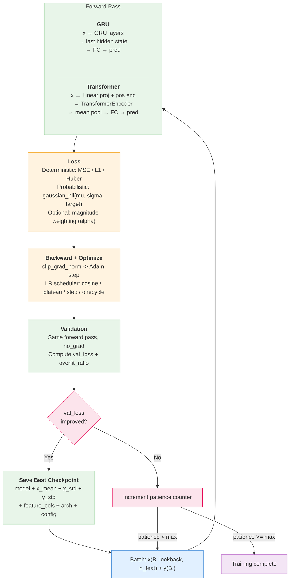
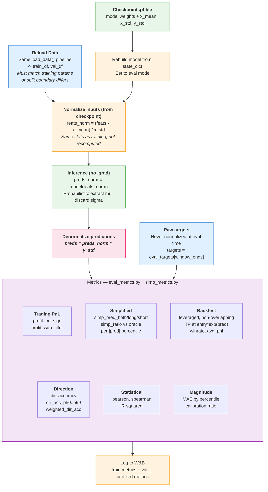

# Stage 1 ML Pipeline — E2E Flow

## High-Level Pipeline



---

## Detailed Pipeline

### 1. Data Loading & Feature Engineering



### 2. Normalization & Sequence Building



### 3. Training Loop



### 4. Evaluation & Metrics



---

## Normalization Summary

| Stage | What | How | Where |
|---|---|---|---|
| Feature creation | volatility, MAs, momentum, vol_regime | log1p(), ratios, log(close/MA) | `features.py` |
| Leakage prevention | volatility, volume_ma, MAs, mom, vol_regime, log_tr, price_accel | np.roll(x, 1) / shift(1) | `features.py:176-230` |
| Input normalization | All feature columns | z-score: (x - x_mean) / x_std | `standard.py:129` |
| Target normalization | log-return targets | **scale only: y / y_std** (no mean) | `standard.py:131` |
| Stats source | x_mean, x_std, y_std | Computed from **TRAIN split only** | `sequences.py:54-91` |
| Eval normalization | Eval features | Same z-score with **checkpoint stats** (not recomputed) | `stage1_eval.py:56` |
| Denormalization | Predictions at eval | **preds * y_std** | `stage1_eval.py:68` |

> **Caveat:** At eval time, data is reloaded fresh via `load_data()`. The normalization stats (x_mean, x_std, y_std) always come from the checkpoint (identical to training). However, the train/val **split boundary** depends on which data is loaded — if `data_pattern`, `load_limit`, or the parquet files differ from training, the val set will contain different rows.

## Data Shape at Each Stage

```
Raw trades:     (N_trades, 4)      timestamp, price, amount, side
OHLCV bars:     (N_bars, 7)        timestamp, open, high, low, close, volume, buy_ratio
After features: (N_bars', ~35)     OHLCV + indicators  (shorter: dropna on rolling windows)
After target:   (N_bars'', ~36)    + target col         (shorter: forward shift drops tail)
After split:    train 80% / val 20%  (temporal, no shuffle)
Sequences:      (B, lookback, n_features) + (B,) target
Model output:   (B,) or (B, n_horizons) or ((B,n_h), (B,n_h)) if probabilistic
```

## Key Files

| Component | File |
|---|---|
| Data loading | `crypto_trader/data/loader.py` |
| Bar resampling | `crypto_trader/data/resampler.py` |
| Feature engineering | `crypto_trader/data/features.py` |
| Feature column defs | `crypto_trader/constants.py` |
| Sequence dataset + norm | `crypto_trader/models/sequences.py` |
| Training orchestration | `crypto_trader/models/standard.py` |
| Training loop | `crypto_trader/models/training.py` |
| Loss functions | `crypto_trader/models/losses.py` |
| GRU / Transformer | `crypto_trader/models/gru.py` |
| Stage 1 dispatcher | `crypto_trader/trainer/stage1.py` |
| Evaluation | `crypto_trader/eval/stage1_eval.py` |
| Metrics | `crypto_trader/eval/eval_metrics.py` |
| Simplified metrics | `crypto_trader/eval/simp_metrics.py` |
| SNR / risk-coverage | `crypto_trader/eval/evaluation.py` (unused) |
| CLI entry point | `run.py` |
